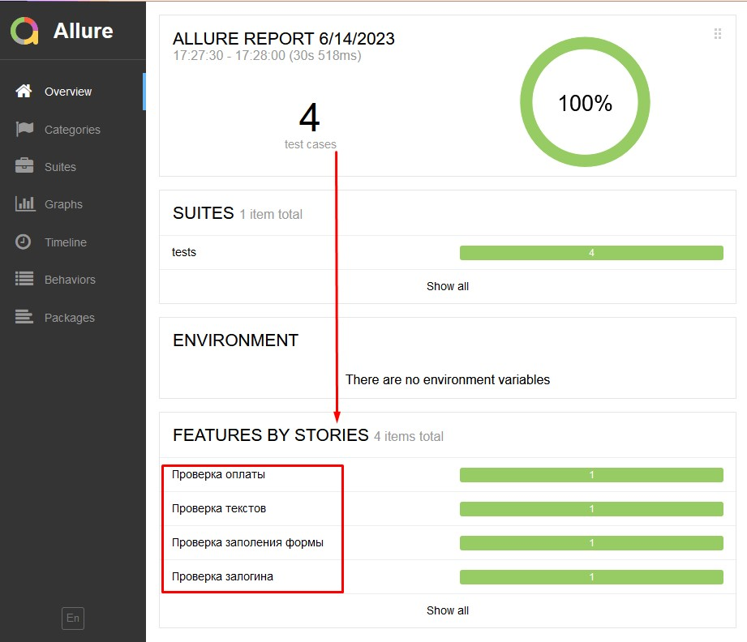
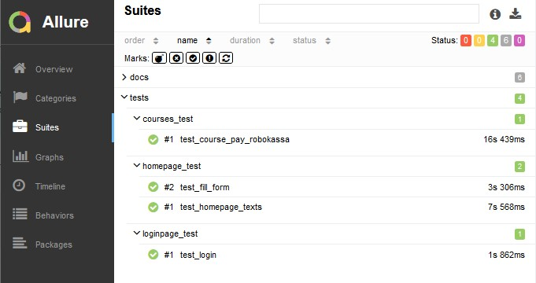
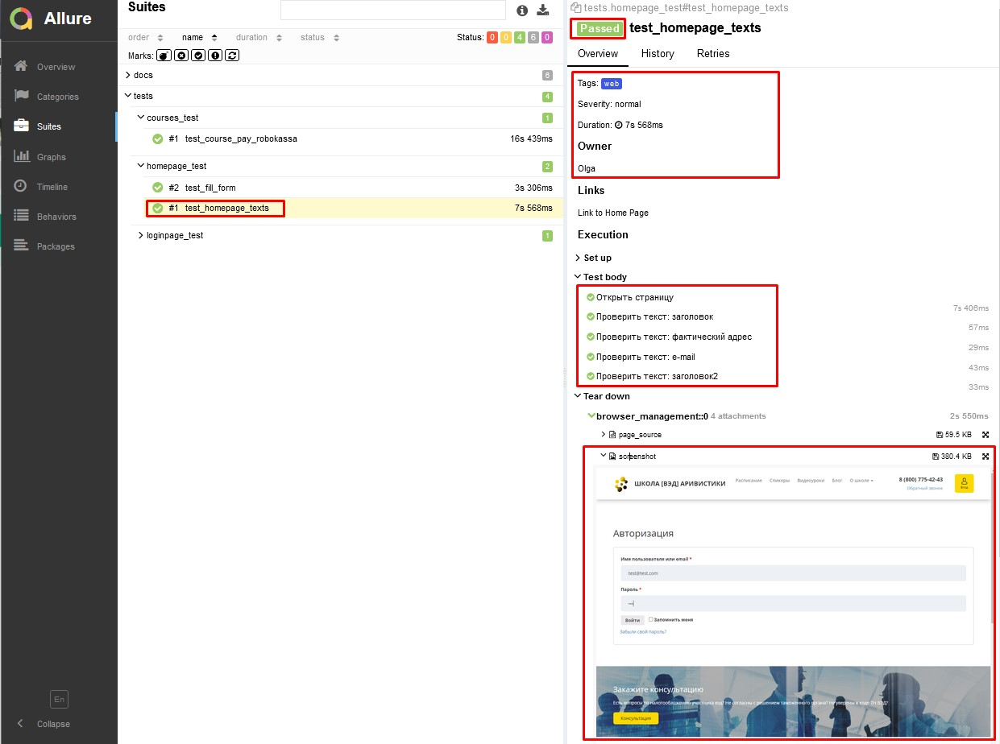
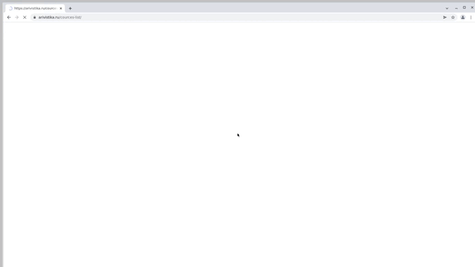

# Arivistika


## Site:

https://arivistika.ru/ (продажа курсов ВЭД)

## Description:

В этом репозитории:
- Демо-проект с <b>автотестами</b> на <b>Python</b>.
- Настроен запуск тестов "одной кнопкой" с любого компьютера со стабильным интернетом. Установка ПО не требуется.
- ~~Визуальный отчет о прохождении тестов. Отчет может сформировать любой сотрудник: оценить тестовое покрытие и/или  передать разработчикам информацию о проблеме.~~
- ~~После выполнения каждого теста записывается видео и скриншот экрана.~~
- Уведомление о результатах тестов в <b>Telegramm</b> группу.

## Stack:
<code></code>
<code></code>
<code></code>
<code></code>
<code></code>
<code></code>
<code></code>
<br>
- Язык: `Python`
- Для написания UI-тестов используется фреймворк `Selene`, современная «обёртка» вокруг `Selenium WebDriver`
- Библиотека модульного тестирования: `PyTest`
- `Jenkins` выполняет удаленный запуск тестов в графическом интерфейсе. Установки дополнительных приложений на компьютер пользователя не требуется.
- `Selenoid` запускает браузер с тестами в контейнерах `Docker` (и записывает видео)
- Фреймворк`Allure Report` собирает графический отчет о прохождении тестов
- После завершения тестов `Telegram Bot` отправляет в `Telegram` краткий вариант Allure Report

## Tests:
- [x] Проверка уведомления об ошибке залогина
- [x] Проверка соответствия текстов на главной странице сайта
- [x] Заполнение формы регистрации.
- [x] Проверка оплаты видеоурока "Курс PRO Декларирование" (Robokassa)

## Как запустить тесты:
### Вариант 1. Локальный запуск 

1. Скачать проект и открыть в среде разработки
2. Запустить тесты командой из терминала 
```
pytest tests/.
```
3. Выполнить запрос на формирование отчета
<br><b>note:</b> это команда для Windows
``` 
allure\bin\allure.bat serve allure-results
```
Результат: откроется страница с отчетом Allure Report

### Вариант 2. Удаленный запуск тестов (<b><a target="_blank" href="https://jenkins.autotests.cloud/job/Demo-Arivistika-Python/">Jenkins</a></b>)
<details>
   <summary>Краткая инструкция</summary>

1. <i>Зарегистрированным</i>* пользователем перейти** на страницу сборки проекта 
   
2. Выбрать желаемые "параметры сборки" в графическом интерфейсе или оставить как есть.
3. Запустить выполнение тестов кнопкой "Собрать..."
4. Убедиться, что в блоке История сборок появилась новая запись.
5. Дождаться окончания активного процесса (~1 мин)
6. Кликнуть по значку или тексту Allure Report
<p>Результат: откроется страница с отчетом Allure Report</p>

> <p>* Незарегистрированным пользователем можно открывать только готовый, ранее сформированный отчет (стрелка №2 на скриншоте)</p>
> <p>**NB! Срок хранения сборки на сервере ~60 дней. Ссылка может оказаться недоступной после 26.09.2023</p>

<p>Образец:</p>

<br>
</details>

## Allure: пример отчета
<details>
   <summary>Скриншоты</summary>

###### Главный экран (Owerwiev)

###### Страница со списком тестов (Suites)

###### Пример описания пройденного  теста


</details>

## Видео тестов
Видеозапись каждого теста генерируется с помощью `Selenoid`, после успешного запуска контейнера c тестами в `Docker`. 
<details>
<summary>Видеозапись</summary>
<p>Образец:</p>
   

</details>

## Отчет в Telegram
После завершения сборки специальный Telegram-бот отправляет сообщение с отчетом.
Чтобы видеть его увидеть, вступите (временно) в группу `OlgaKos Bot_Group`

<details>
<summary>Скриншот</summary>

</details>

------------
#### TODO:
- [ ] fix Jenkins
- [x] add Telegram

------------
ver 2023-07-27 home (Jenkins is bad)
ver 2023-08-01 home